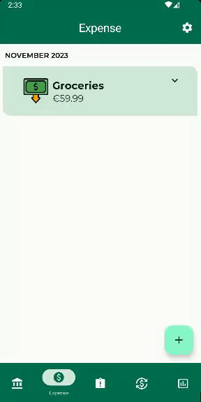

# ExpenseSage
THE app for managing your expenses!

## Table of Contents
- [ExpenseSage](#expensesage)
  - [Table of Contents](#table-of-contents)
  - [Description](#description)
  - [Usage](#usage)
  - [Screenshots](#screenshots)
  - [Testing](#testing)

## Description
ExpenseSage is a simple app for managing your expenses. 
It allows you to add expenses, view expenses, and delete expenses. 

It also allows you to view a summary of your expenses.

## Usage
An apk is available for download in the repo, as ExpenseSage.apk. To run the app, you may need to tweak your phone settings to download from unknown sources.

## Screenshots
 Screenshots of the app are available in the Documents/images folder. Here are a few of them:

## Testing
There are a couple of tests for ExpenseSage. Every screen and every viewModel is tested with UI tests and Unit tests respectively